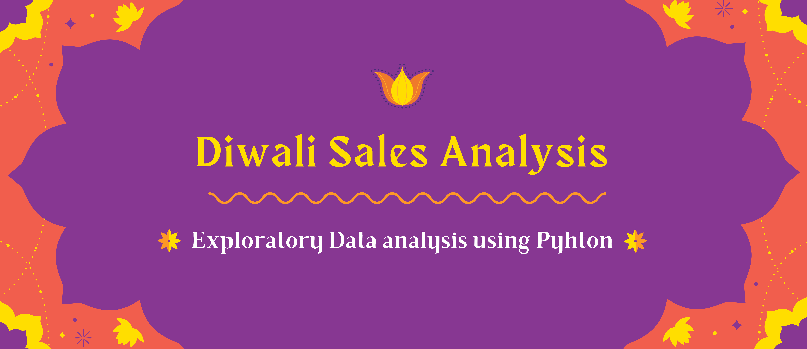

# Diwali Sales Data Analysis Using Python




## Table of Contents
- [Project Overview](#project-overview)
- [Installation](#installation)
- [Contributing](#contributing)


## Project Overview

This project focuses on analyzing Diwali sales data using Python's data manipulation and visualization libraries - pandas, matplotlib, and seaborn. By leveraging these tools, the project provides insights into sales trends, customer behavior, and more, offering valuable business insights for the festive season.

#### The analysis covers:
- Exploratory Data Analysis (EDA) of Diwali sales data
- Visualizing sales trends and patterns using line plots, bar charts, and more
- Understanding customer preferences and purchasing behavior during the Diwali season


## Installation

1. Clone the repository to your local machine:
   
   ```bash
   git clone https://github.com/yourusername/diwali-sales-analysis.git
   ```
2. Install the required Python packages using pip:
   
    ```bash
    pip install pandas matplotlib seaborn
    ```

<br>

## Contributing

Contributions are welcome! If you have ideas for improvements or want to add more questions, please follow these steps:
1. Fork the repository.
2. Create a new branch for your feature: `git checkout -b feature-new-question`
3. Commit your changes: `git commit -m 'Add a new question'`
4. Push to the branch: `git push origin feature-new-question`
5. Submit a pull request.
